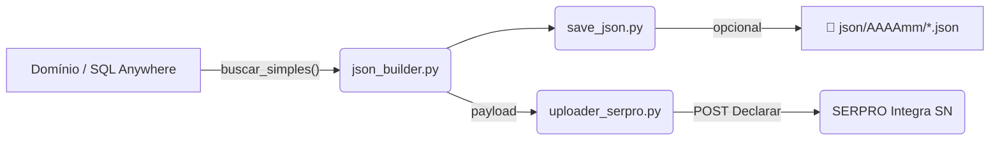

# Integra-SN • PGDAS-D Automation

Automatiza a geração, validação e (opcionalmente) **transmissão** da declaração mensal do Simples Nacional (PGDAS-D) a partir do banco *Domínio Sistemas* até a API **Integra SN – SERPRO**.

---

## 1 • Fluxo resumido



1. **`buscar_simples()`** – extrai no banco Domínio as receitas do período.
2. **`montar_json()`** – calcula totais, mapeia idAtividade (heurística + fuzzy) e gera o *payload* fiscal.
3. **`save_json.py`** – grava uma cópia legível/compacta para auditoria.
4. **`uploader_serpro.py`** – envelopa o payload, assina-o com *Bearer + JWT* e envia ao endpoint `/Declarar`.

---

## 2 • Estrutura

```
PgDas/
│
├── auth/                 # OAuth 2.0 + mTLS
│   └── token_auth.py
├── database/
│   └── dominio_db.py     # conexão SQL Anywhere + consultas
├── dicionario_id/        # inteligência de idAtividade (1-43)
│   ├── segment_rules.py  # dicionário 
│ 
├── utils/
│   ├── json_builder.py   # gera payload fiscal
│   ├── save_json.py      # persiste JSON
│   └── uploader_serpro.py
├── json/                 # saídas locais (*.json)
├── .env                  # segredos (NUNCA versione!)
└── main.py               # script de exemplo
```

---

## 3 • Variáveis de ambiente

| Chave                                                          | Descrição                                                   |
|----------------------------------------------------------------|-------------------------------------------------------------|
| **Banco**                                                      |                                                             |
| `DB_HOST`, `DB_PORT`, `DB_NAME`, `DB_USER`, `DB_PASS`          | Acesso SQL Anywhere (Domínio)                               |
| **SERPRO**                                                     |                                                             |
| `URL_BASE`                                                     | Ex.: `https://apicenter.estaleiro.serpro.gov.br/.../PGDASD` |
| `API_KEY_SERPRO`                                               | Chave da aplicação                                          |
| `CNPJ_CONT`                                                    | CNPJ do escritório/contador (autor & contratante)           |
| **Certificado mTLS**                                           |                                                             |
| `CAMINHO_CERTIFICADO`, `NOME_CERTIFICADO`, `SENHA_CERTIFICADO` |                                                             |
| **OAuth**                                                      |                                                             |
| `CONSUMER_KEY`, `CONSUMER_SECRET`, `URL_AUTENTICACAO`          |                                                             |

> Coloque tudo em **`.env`** e mantenha-o fora do controle de versão.

---

## 4 • Instalação

```bash
python -m venv .venv
source .venv/bin/activate              # Windows: .venv\Scripts\activate
pip install -r requirements.txt
cp .env.example .env                   # edite com suas chaves
```

---


* Gera o payload, grava em `json/202505/` e faz **simulação**
  (`indicadorTransmissao=False`, `indicadorComparacao=True`).
* Ajuste em `json_builder.py` se quiser transmitir de fato.

---

## 6 • Boas práticas de segurança

* Nenhum segredo é armazenado em código fonte; tudo via `.env`.
* Certificado *.pfx* é convertido para DER em tempo de execução (arquivo temporário).
* Tokens OAuth são armazenados apenas em memória e renovados automaticamente.
* **Nunca envie** `.env`, `.pfx` ou logs de payload para repositórios públicos.

---

## 7 • Roadmap / IDEIAS

* Implementar `buscar_folha()` para preencher *folha de salário*.
* Incluir rotinas de **monitoramento** (`/Monitorar`) para acompanhar o status após envio.
* Empacotar como *CLI* (`pgdas-cli declara --cnpj ... --pa ...`).

---
